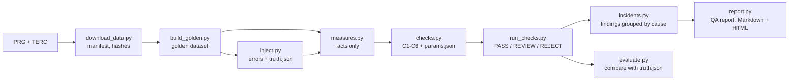

# voro-gis-qa

Quality checks for GIS data, tested against errors I put in on purpose.

I take the official boundaries of Polish municipalities, check them with six rules and then break the data in a controlled way. Every broken item is logged. After that I can see not only what the checks found, but also what they missed.

This is also the second environment of VORO, my decision system (more below).

## Results

### Golden dataset

Source: PRG boundary register (GUGiK). Names checked against TERC (Statistics Poland).

| | |
|---|---|
| Municipalities / counties | 2,479 / 380 |
| TERYT codes | unique, nested correctly, no orphans |
| Invalid geometries | 0 |
| Neighbour pairs checked | 7,075, no overlaps, no gaps |
| Name differences PRG vs TERC | 1 of 2,479 |
| Status | PASS 2,479 / 2,479 |

The one difference is municipality `2602072`. PRG calls it "Słupia (Jędrzejowska)", TERC calls it "Słupia". Both registers are official, they just use different names. I did not add a general rule like "ignore brackets", because such a rule could hide a real error later. The case is written down in [`known_exceptions.json`](known_exceptions.json) with both names, the reason and the date. It only works on an exact match. If one letter changes, the check reports it again.

### Injected errors (seed 42)

8 error types, 20 of each, 160 in total.

| Error | Injected | Found |
|---|---|---|
| E1 self-intersecting geometry | 20 | 20 |
| E2 TERYT code copied from another municipality | 20 | 20 |
| E3 wrong county in the code | 20 | 20 |
| E4 one municipality in the wrong coordinate system | 20 | 20 |
| E5 municipality shifted by 5 to 200 m | 20 | 20 |
| E6 gap on the border with a neighbour | 20 | 20 |
| E7 Polish characters removed from the name | 20 | 20 |
| E8 empty name | 20 | 20 |

160 of 160 found, 0 false alarms, F1 = 1.000 for all six checks.

I don't trust this result yet. The errors are big (shifts from 5 m, gaps from 20 m) and none of them is close to a tolerance limit, so the checks had nothing to get wrong. The next injector will have smaller errors, under one metre and close to the limits.

Second problem: 40 topology errors gave 2,146 findings and 396 municipalities in REVIEW. A shifted municipality leaves many thin slivers along its border and every sliver is reported to every neighbour. All of it is correct, but nobody will read such a report.

So findings are now grouped by cause. Municipalities are linked when they overlap, when they touch the same gap, or when a broken municipality lies where the gap is. Each linked group is one incident.

Seed 42: 2,335 findings became 170 incidents. All 160 errors are inside an incident, and no incident is made of municipalities that no error touched. I wrote these expectations into git before the code (160 of 160 covered, 160 to 190 incidents).

14 incidents contain only neighbours. A municipality moved to the wrong coordinate system lands far away from the hole it left, so the hole becomes its own incident.

### Same result on two machines

I built the golden dataset again on a second machine, a rented server, from the same source file. The content hash is the same: `7ab654de80f450ed…`

The hash is calculated from TERYT, name and normalized geometry, not from the file itself. A GeoPackage gets new bytes every time it is saved, so a file hash would not prove anything.

## How it works



### The six checks

| Check | What it looks at | Severity |
|---|---|---|
| C1 | geometry valid and not empty | critical |
| C2 | TERYT: 7 digits, unique, type 1, 2 or 3 | critical |
| C3 | municipality inside its county | critical |
| C4 | coordinate system and extent of Poland | critical |
| C5 | overlaps and gaps between neighbours | high |
| C6 | name exists and matches TERC | medium |

Thresholds are in [`params.json`](params.json). One critical finding gives REJECT. Only non-critical findings give REVIEW. No findings gives PASS.

### QA report

`report.py` writes a report in Markdown and HTML: status, source and date of the data, coordinate system, results of C1 to C6, all incidents with the probable cause (code and name of the municipality), known exceptions, the parameters with their hash and the code version, and a check that all numbers add up. The report never reads `truth.json`. It shows only what a client would see.

### Rules I follow

- Measuring and judging are separate. `measures.py` only measures (validity, distances, areas of overlaps and gaps, names) and has no thresholds. `checks.py` compares those numbers with `params.json`. I tested the split on 32 synthetic test datasets and the findings stayed exactly the same.
- The code that decides never reads `truth.json`. Only `evaluate.py` does, after the decision.
- Rules and expected results go into git before the code that uses them.
- Numbers must add up. A simple test (statuses must sum to the number of municipalities) already caught a bug in my own code.

## VORO

VORO is my decision system built as a chain of steps: Observation, Identity, Hypothesis, Knowledge, Evidence, Interpretation, Reasoning, Decision, Verification. The core is in a private repository. Here is only the adapter, in [`voro_adapter/`](voro_adapter/): the data provider, the domain package, the patches for VORO and the regression test.

Moving VORO to GIS data showed a weak point. It could only accept or reject one fixed hypothesis. Now it compares three (PASS, REVIEW, REJECT) and picks one:

| Dataset | PASS | REVIEW | REJECT | Decision |
|---|---|---|---|---|
| golden | 1.0 | 0.76 | 0.76 | PASS |
| seed 42 (critical and other errors) | 0.0 | 0.90 | 1.0 | REJECT |
| seed 7 (only non-critical errors) | 0.76 | 1.0 | 0.90 | REVIEW |

The numbers are readiness for each hypothesis.

How it looked step by step:

| Stage | Result on GIS data |
|---|---|
| start | ABSTAIN on every dataset, readiness 0.497. The "strongest signal" was the number of municipalities. |
| facts and relations added | ACCEPT on every dataset, readiness 1.0. Fully confident, also on the dataset with 160 errors. |
| three hypotheses compared | PASS, REJECT and REVIEW on the three datasets above |

VORO's first domain (football match data) had a regression test during all changes. Its result did not move, readiness 0.9254 every time.

## Quick start

```bash
git clone https://github.com/MR73BIIO/voro-gis-qa.git
cd voro-gis-qa
python3 -m venv .venv && source .venv/bin/activate
pip install -r requirements.txt
```

TERC must be downloaded by hand from [eteryt.stat.gov.pl](https://eteryt.stat.gov.pl) (TERC, basic version, CSV). Don't open it in Excel and save it again, it can change the codes.

```bash
python scripts/download_data.py --terc path/to/TERC_Urzedowy_YYYY-MM-DD.csv
python scripts/build_golden.py
python scripts/build_golden.py --verify

python scripts/run_checks.py
python scripts/inject.py --seed 42 --n 20
python scripts/run_checks.py --data data/runs/seed_42/corrupted.gpkg
python scripts/evaluate.py --truth data/runs/seed_42/truth.json
python scripts/report.py

python -m pytest -q tests/
```

The `data/` folder is not in the repository. [`manifest.json`](manifest.json) has the source address, the file hashes and the content hash of the golden dataset, so you can rebuild it and compare.

My server outside Poland could not reach `opendata.geoportal.gov.pl`. If you have the same problem, download the PRG package on a machine in Poland, copy it and run `download_data.py --skip-download`.

## Known limitations

- The injected errors are too easy (see above).
- C5 finds gaps as holes inside the coverage. A gap that touches the state border is not a hole, so it is not found yet. Plan: compare with the state border layer.
- A municipality moved to the wrong coordinate system gives two incidents: one for itself, one for the hole it left.
- VORO's Verification only checks that the decision points to the right reasoning. Checking the decision against the truth comes later. VORO does not learn yet.

## Next steps

1. Gaps at the state border.
2. Verification against the truth after each decision, results saved in memory.
3. Second run: harder errors, hypothesis written down before the test, thresholds tuned on some regions and tested on others. I will publish the result whatever it is.
4. Real data: OpenStreetMap boundaries compared with PRG, open tree inventories from cities in Germany, Austria and Switzerland.

## Data and license

- PRG: Państwowy Rejestr Granic, Główny Urząd Geodezji i Kartografii (GUGiK), open data.
- TERC: Krajowy Rejestr Urzędowy Podziału Terytorialnego Kraju (TERYT), Główny Urząd Statystyczny (GUS).

Code under the [MIT License](LICENSE). The data keep the terms of their publishers.

## Author

Marcin Ruszczak, [MR73BIIO](https://github.com/MR73BIIO), [LinkedIn](https://www.linkedin.com/in/marcin-ruszczak-27b37b19b)
GIS, data validation, Python. Polish, German, Russian, English.
